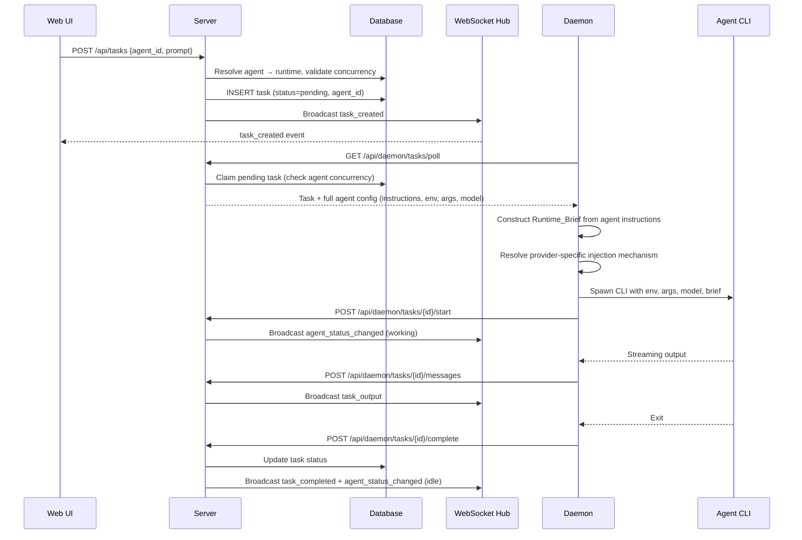
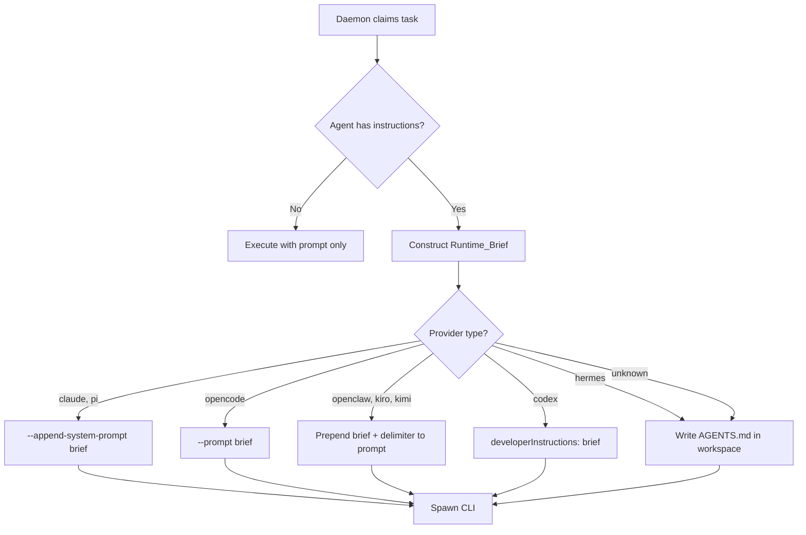
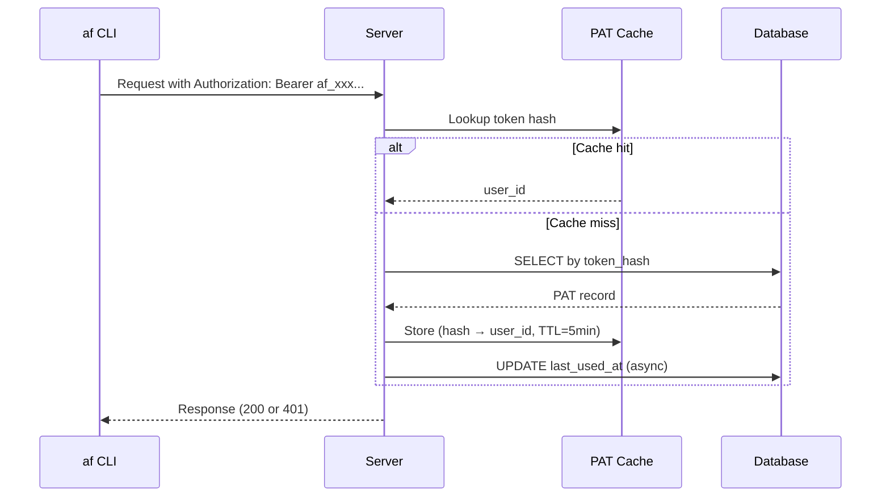

# Design Document: Agent Management

## Overview

This feature replaces AgenticFlow's basic "Custom Agents" (CLI command wrappers) with a full agent lifecycle system modeled after multica's agent architecture. It introduces rich agent configuration with instructions/system prompts, browser-based Personal Access Token management, user registration, provider-specific prompt routing through agent instructions (Runtime_Brief), and real-time agent activity tracking via WebSocket.

### Design Goals

- **Multica parity**: Mirror multica's agent backend interface, provider-specific system prompt injection, and PAT management patterns
- **Runtime_Brief injection**: Daemon constructs a Runtime_Brief from agent instructions and passes it to CLI backends via provider-specific mechanisms
- **Seamless migration**: Evolve from `custom_agent` table to full `agent` table preserving existing data
- **Real-time status**: Derive agent status (idle/working/offline) from runtime state and broadcast changes via WebSocket

### Key Design Decisions

| Decision | Rationale |
|----------|-----------|
| New `agent` table (not alter `custom_agent`) | Clean schema with proper constraints; migration copies data |
| Provider-specific brief injection | Matches multica's proven pattern — each CLI has different mechanisms |
| Status derived server-side | Single source of truth; avoids daemon/client disagreement |
| PAT with `af_` prefix + SHA-256 hash | Industry standard; prefix aids debugging; hash prevents DB leak |
| Blocked env key list | Prevents accidental override of daemon-internal variables |
| Per-agent concurrency independent of daemon cap | Granular control without coupling agent limits to daemon limits |

## Architecture

### Component Interaction for Agent Task Execution



### Runtime_Brief Construction and Injection Flow



### PAT Authentication Flow



## Components and Interfaces

### 1. Server: Agent Handler (`internal/handler/agent.go`)

Replaces the existing `custom_agent` handlers with full agent CRUD.

```go
// internal/handler/agent.go

type AgentResponse struct {
    ID                 string            `json:"id"`
    Name               string            `json:"name"`
    Description        string            `json:"description"`
    Instructions       string            `json:"instructions"`
    AvatarURL          *string           `json:"avatar_url"`
    RuntimeID          string            `json:"runtime_id"`
    CustomEnv          map[string]string `json:"custom_env"`
    CustomArgs         []string          `json:"custom_args"`
    Model              string            `json:"model"`
    Visibility         string            `json:"visibility"`
    Status             string            `json:"status"` // derived: idle, working, offline
    MaxConcurrentTasks int32             `json:"max_concurrent_tasks"`
    OwnerID            string            `json:"owner_id"`
    CreatedAt          string            `json:"created_at"`
    UpdatedAt          string            `json:"updated_at"`
}

type CreateAgentRequest struct {
    Name               string            `json:"name"`
    Description        string            `json:"description"`
    Instructions       string            `json:"instructions"`
    AvatarURL          *string           `json:"avatar_url"`
    RuntimeID          string            `json:"runtime_id"`
    CustomEnv          map[string]string `json:"custom_env"`
    CustomArgs         []string          `json:"custom_args"`
    Model              string            `json:"model"`
    Visibility         string            `json:"visibility"`
    MaxConcurrentTasks int32             `json:"max_concurrent_tasks"`
}

type UpdateAgentRequest struct {
    Name               *string            `json:"name"`
    Description        *string            `json:"description"`
    Instructions       *string            `json:"instructions"`
    AvatarURL          *string            `json:"avatar_url"`
    RuntimeID          *string            `json:"runtime_id"`
    CustomEnv          *map[string]string `json:"custom_env"`
    CustomArgs         *[]string          `json:"custom_args"`
    Model              *string            `json:"model"`
    Visibility         *string            `json:"visibility"`
    MaxConcurrentTasks *int32             `json:"max_concurrent_tasks"`
}

// Validation constants
const (
    maxAgentNameLength        = 64
    maxAgentDescriptionLength = 255
    maxAgentInstructionsLength = 50000
    maxAgentModelLength       = 100
    maxCustomEnvPairs         = 20
    maxCustomEnvKeyLength     = 64
    maxCustomEnvValueLength   = 1024
    maxCustomArgs             = 20
    maxCustomArgLength        = 256
    minConcurrentTasks        = 1
    maxConcurrentTasks        = 20
)

// agentNameRegex validates agent names: starts with alphanumeric,
// followed by alphanumeric, hyphens, or underscores.
var agentNameRegex = regexp.MustCompile(`^[a-zA-Z0-9][a-zA-Z0-9_-]{0,63}$`)
```

**API Routes** (added to the protected group in `cmd/server/router.go`):

```go
// Agent CRUD
r.Post("/api/agents", h.CreateAgent)
r.Get("/api/agents", h.ListAgents)
r.Get("/api/agents/{id}", h.GetAgent)
r.Put("/api/agents/{id}", h.UpdateAgent)
r.Delete("/api/agents/{id}", h.DeleteAgent)
```

### 2. Server: PAT Handler (`internal/handler/personal_access_token.go`)

Mirrors multica's PAT handler with `af_` prefix and configurable expiry.

```go
// internal/handler/personal_access_token.go

const (
    patPrefix    = "af_"
    patTokenLen  = 64 // hex characters after prefix
    patPrefixLen = 12 // stored for display
    patMaxName   = 64
)

type CreatePATRequest struct {
    Name          string `json:"name"`
    ExpiresInDays *int   `json:"expires_in_days"` // 30, 90, 365, or nil (no expiry)
}

type PATResponse struct {
    ID         string  `json:"id"`
    Name       string  `json:"name"`
    Prefix     string  `json:"token_prefix"`
    ExpiresAt  *string `json:"expires_at"`
    LastUsedAt *string `json:"last_used_at"`
    CreatedAt  string  `json:"created_at"`
}

type CreatePATResponse struct {
    PATResponse
    Token string `json:"token"` // returned exactly once
}
```

**API Routes**:

```go
// Token management
r.Get("/api/tokens", h.ListPersonalAccessTokens)
r.Post("/api/tokens", h.CreatePersonalAccessToken)
r.Delete("/api/tokens/{id}", h.RevokePersonalAccessToken)
```

### 3. Server: Auth Handler (`internal/handler/auth.go`)

Adds user registration endpoint alongside existing login.

```go
// internal/handler/auth.go

type RegisterRequest struct {
    Email    string `json:"email"`
    Password string `json:"password"`
    Name     string `json:"name"`
}

type AuthResponse struct {
    Token     string `json:"token"`
    ExpiresAt string `json:"expires_at"`
    User      UserResponse `json:"user"`
}

// POST /auth/register — creates user + returns PAT
func (h *Handler) Register(w http.ResponseWriter, r *http.Request)
```

**Validation rules**:
- Email: contains exactly one `@`, domain has at least one `.`, max 254 chars
- Password: 8–128 characters
- Name: 1–128 characters after trimming whitespace

### 4. Server: Agent Status Service (`internal/service/agent_status.go`)

Derives agent status from runtime state and active task count.

```go
// internal/service/agent_status.go

type AgentStatusService struct {
    queries *db.Queries
    hub     *realtime.Hub
}

// DeriveStatus computes the agent's current status.
// Priority: offline > working > idle
func (s *AgentStatusService) DeriveStatus(ctx context.Context, agentID uuid.UUID) (string, error) {
    agent, _ := s.queries.GetAgent(ctx, agentID)
    runtime, _ := s.queries.GetAgentRuntime(ctx, agent.RuntimeID)
    
    if runtime.Status == "offline" {
        return "offline", nil
    }
    
    activeCount, _ := s.queries.CountActiveTasksForAgent(ctx, agentID)
    if activeCount > 0 {
        return "working", nil
    }
    return "idle", nil
}

// ReconcileAndBroadcast recomputes status and broadcasts if changed.
func (s *AgentStatusService) ReconcileAndBroadcast(ctx context.Context, agentID uuid.UUID)
```

### 5. Daemon: Runtime_Brief Construction (`internal/daemon/brief.go`)

Constructs the system prompt payload from agent instructions.

```go
// internal/daemon/brief.go

// BuildRuntimeBrief constructs the markdown document injected into the CLI.
// Returns empty string if instructions are empty.
func BuildRuntimeBrief(agentName, instructions, workspaceContext string) string {
    if instructions == "" {
        return ""
    }
    var b strings.Builder
    b.WriteString("## Agent Identity\n\n")
    b.WriteString(fmt.Sprintf("You are **%s**.\n\n", sanitizeName(agentName)))
    b.WriteString("## Instructions\n\n")
    b.WriteString(instructions)
    b.WriteString("\n\n")
    if workspaceContext != "" {
        b.WriteString("## Workspace Context\n\n")
        b.WriteString(workspaceContext)
        b.WriteString("\n\n")
    }
    return b.String()
}
```

### 6. Daemon: Provider-Specific Injection (`internal/daemon/inject.go`)

Routes the Runtime_Brief to the CLI via the appropriate mechanism per provider.

```go
// internal/daemon/inject.go

// InjectBrief applies the Runtime_Brief to ExecOptions based on provider type.
func InjectBrief(provider string, brief string, prompt string, workspaceDir string, opts *agent.ExecOptions) (string, error) {
    if brief == "" {
        return prompt, nil
    }
    switch provider {
    case "claude", "pi":
        opts.SystemPrompt = brief // backend uses --append-system-prompt
    case "opencode":
        opts.SystemPrompt = brief // backend uses --prompt
    case "codex":
        opts.SystemPrompt = brief // backend uses developerInstructions
    case "openclaw", "kiro", "kimi":
        // Prepend to user prompt with delimiter
        prompt = brief + "\n\n---\n\n" + prompt
    case "hermes":
        // Write to AGENTS.md in workspace
        err := os.WriteFile(filepath.Join(workspaceDir, "AGENTS.md"), []byte(brief), 0644)
        if err != nil {
            return prompt, fmt.Errorf("write AGENTS.md: %w", err)
        }
    default:
        // Unknown provider: fallback to AGENTS.md
        err := os.WriteFile(filepath.Join(workspaceDir, "AGENTS.md"), []byte(brief), 0644)
        if err != nil {
            return prompt, fmt.Errorf("write AGENTS.md: %w", err)
        }
    }
    return prompt, nil
}
```

### 7. Daemon: Environment Resolution (`internal/daemon/execenv/env.go`)

Merges agent-level, task-level, and daemon-level environment variables with proper precedence and blocked key filtering.

```go
// internal/daemon/execenv/env.go

// blockedEnvKeys are keys that cannot be overridden by agent custom_env.
var blockedEnvKeys = map[string]bool{
    "HOME": true, "PATH": true, "USER": true,
    "SHELL": true, "TERM": true,
}

// blockedEnvPrefixes are prefixes that cannot be overridden.
var blockedEnvPrefixes = []string{"AF_"}

// IsBlockedEnvKey returns true if the key is blocked from custom_env override.
func IsBlockedEnvKey(key string) bool {
    if blockedEnvKeys[key] {
        return true
    }
    for _, prefix := range blockedEnvPrefixes {
        if strings.HasPrefix(key, prefix) {
            return true
        }
    }
    return false
}

// MergeEnv combines daemon, agent, and task environment variables.
// Precedence: task > agent > daemon (highest wins for duplicate keys).
// Blocked keys from agent/task levels are skipped.
func MergeEnv(daemonEnv, agentEnv, taskEnv map[string]string) map[string]string {
    result := make(map[string]string, len(daemonEnv)+len(agentEnv)+len(taskEnv))
    for k, v := range daemonEnv {
        result[k] = v
    }
    for k, v := range agentEnv {
        if IsBlockedEnvKey(k) {
            continue
        }
        result[k] = v
    }
    for k, v := range taskEnv {
        if IsBlockedEnvKey(k) {
            continue
        }
        result[k] = v
    }
    return result
}
```

### 8. Daemon: Task Claim Response Extension

The task poll response is extended to include full agent configuration:

```go
// Task claim response (from GET /api/daemon/tasks/poll)
type TaskClaimResponse struct {
    ID        string         `json:"id"`
    AgentType string         `json:"agent_type"`
    Prompt    string         `json:"prompt"`
    Agent     *TaskAgentData `json:"agent,omitempty"`
}

type TaskAgentData struct {
    ID           string            `json:"id"`
    Name         string            `json:"name"`
    Instructions string            `json:"instructions"`
    CustomEnv    map[string]string `json:"custom_env,omitempty"`
    CustomArgs   []string          `json:"custom_args,omitempty"`
    Model        string            `json:"model,omitempty"`
}
```

### 9. Web UI Components

#### Settings Page (`web/src/pages/Settings.tsx`)

Tab-based settings page with token management:

```typescript
// pages/Settings.tsx
export function SettingsPage() {
    const [activeTab, setActiveTab] = useState<'tokens'>('tokens');
    return (
        <Layout>
            <TabNav tabs={[{ id: 'tokens', label: 'Tokens' }]} active={activeTab} />
            {activeTab === 'tokens' && <TokenManagement />}
        </Layout>
    );
}
```

#### Token Management (`web/src/components/TokenManagement.tsx`)

- Token list with name, masked prefix, dates, revoke button
- Create form with name input and expiry dropdown
- Post-creation modal showing full token with copy button and warning

#### Login/Register Page (`web/src/pages/Login.tsx`)

- Toggle between sign-in and registration forms
- Registration form: email, password, name fields with inline validation
- On successful registration: store returned PAT, redirect to dashboard

#### Agent List Page (`web/src/pages/AgentList.tsx`)

- Grid of agent cards with status badges (color-coded)
- Real-time status updates via WebSocket
- "Create Agent" button navigating to `/agents/new`

#### Agent Create/Edit Page (`web/src/pages/AgentForm.tsx`)

- Form fields: name, description, instructions (large textarea), runtime dropdown, model, key-value editor for env, array editor for args, number input for concurrency, visibility toggle
- Runtime dropdown filtered to online runtimes only
- Inline validation matching server-side rules

### 10. WebSocket Events

New events added to the WebSocket hub:

| Event Type | Payload | Trigger |
|------------|---------|---------|
| `agent_created` | `{agent: AgentResponse}` | Agent created via API |
| `agent_updated` | `{agent: AgentResponse}` | Agent updated via API |
| `agent_deleted` | `{agent_id: string}` | Agent deleted via API |
| `agent_status_changed` | `{agent_id: string, status: string}` | Status derivation changes |

These events trigger React Query cache invalidation in the Web UI:

```typescript
// WebSocket event handler
case 'agent_status_changed':
case 'agent_created':
case 'agent_updated':
case 'agent_deleted':
    queryClient.invalidateQueries(['agents']);
    break;
```

## Data Models

### Database Schema Changes

#### New `agent` Table

```sql
CREATE TABLE agent (
    id UUID PRIMARY KEY DEFAULT gen_random_uuid(),
    user_id UUID NOT NULL REFERENCES "user"(id) ON DELETE CASCADE,
    name TEXT NOT NULL CHECK (
        char_length(name) BETWEEN 1 AND 64
        AND name ~ '^[a-zA-Z0-9][a-zA-Z0-9_-]*$'
    ),
    description TEXT NOT NULL DEFAULT '' CHECK (char_length(description) <= 255),
    instructions TEXT NOT NULL DEFAULT '' CHECK (char_length(instructions) <= 50000),
    runtime_id UUID NOT NULL REFERENCES agent_runtime(id),
    model TEXT CHECK (model IS NULL OR char_length(model) <= 100),
    custom_env JSONB NOT NULL DEFAULT '{}',
    custom_args JSONB NOT NULL DEFAULT '[]',
    max_concurrent_tasks INT NOT NULL DEFAULT 1
        CHECK (max_concurrent_tasks BETWEEN 1 AND 20),
    visibility TEXT NOT NULL DEFAULT 'private'
        CHECK (visibility IN ('private', 'shared')),
    avatar_url TEXT CHECK (avatar_url IS NULL OR char_length(avatar_url) <= 2048),
    status TEXT NOT NULL DEFAULT 'idle'
        CHECK (status IN ('idle', 'working', 'offline')),
    created_at TIMESTAMPTZ NOT NULL DEFAULT now(),
    updated_at TIMESTAMPTZ NOT NULL DEFAULT now(),
    UNIQUE(user_id, name)
);

CREATE INDEX idx_agent_user ON agent(user_id);
CREATE INDEX idx_agent_runtime ON agent(runtime_id);
CREATE INDEX idx_agent_status ON agent(status);
CREATE INDEX idx_agent_visibility ON agent(visibility);
```

#### Modified `task` Table

Add `agent_id` column to associate tasks with agents:

```sql
ALTER TABLE task ADD COLUMN agent_id UUID REFERENCES agent(id) ON DELETE SET NULL;
CREATE INDEX idx_task_agent ON task(agent_id);
```

#### Modified `personal_access_token` Table

Add `token_prefix` column for display (if not already present from core design):

```sql
-- Ensure token_prefix column exists
ALTER TABLE personal_access_token
    ADD COLUMN IF NOT EXISTS token_prefix TEXT NOT NULL DEFAULT '';
```

### Migration: `custom_agent` → `agent`

```sql
-- Migration UP (002_agent_table.up.sql)

-- 1. Create new agent table
CREATE TABLE agent ( /* ... as above ... */ );

-- 2. Migrate existing custom_agent data
INSERT INTO agent (user_id, name, description, instructions, runtime_id, model, custom_env, custom_args, max_concurrent_tasks, visibility)
SELECT
    ca.user_id,
    ca.name,
    '',  -- description (custom_agent had none)
    '',  -- instructions (custom_agent had none)
    (SELECT ar.id FROM agent_runtime ar
     JOIN daemon d ON ar.daemon_id = d.id
     WHERE d.user_id = ca.user_id
     ORDER BY ar.created_at ASC LIMIT 1),  -- bind to first runtime
    COALESCE(ca.model_override, ''),
    COALESCE(ca.env_vars, '{}'),
    CASE WHEN ca.args_template != '' AND ca.args_template != '{{prompt}}'
         THEN jsonb_build_array(ca.args_template)
         ELSE '[]'::jsonb END,
    1,  -- default concurrency
    'private'
FROM custom_agent ca
WHERE EXISTS (
    SELECT 1 FROM agent_runtime ar
    JOIN daemon d ON ar.daemon_id = d.id
    WHERE d.user_id = ca.user_id
);

-- 3. Add agent_id to task table
ALTER TABLE task ADD COLUMN agent_id UUID REFERENCES agent(id) ON DELETE SET NULL;
CREATE INDEX idx_task_agent ON task(agent_id);

-- 4. Drop old table (after data is migrated)
DROP TABLE IF EXISTS custom_agent;
```

```sql
-- Migration DOWN (002_agent_table.down.sql)

-- 1. Recreate custom_agent table
CREATE TABLE custom_agent (
    id UUID PRIMARY KEY DEFAULT gen_random_uuid(),
    user_id UUID NOT NULL REFERENCES "user"(id) ON DELETE CASCADE,
    name TEXT NOT NULL CHECK (name ~ '^[a-zA-Z0-9_-]{1,64}$'),
    command TEXT NOT NULL,
    args_template TEXT NOT NULL DEFAULT '{{prompt}}',
    model_override TEXT,
    env_vars JSONB NOT NULL DEFAULT '{}',
    created_at TIMESTAMPTZ NOT NULL DEFAULT now(),
    updated_at TIMESTAMPTZ NOT NULL DEFAULT now(),
    UNIQUE(user_id, name)
);

-- 2. Migrate data back (best effort)
INSERT INTO custom_agent (user_id, name, command, args_template, model_override, env_vars)
SELECT user_id, name, 'agent', '', model, custom_env
FROM agent;

-- 3. Remove agent_id from task
ALTER TABLE task DROP COLUMN IF EXISTS agent_id;

-- 4. Drop agent table
DROP TABLE IF EXISTS agent;
```

### Key Data Types

```go
// internal/service/types.go

// AgentStatusDerived represents the computed agent status.
type AgentStatusDerived string

const (
    AgentStatusIdle    AgentStatusDerived = "idle"
    AgentStatusWorking AgentStatusDerived = "working"
    AgentStatusOffline AgentStatusDerived = "offline"
)

// DeriveAgentStatus computes status from runtime state and task count.
// Priority: offline > working > idle
func DeriveAgentStatus(runtimeStatus string, activeTaskCount int) AgentStatusDerived {
    if runtimeStatus == "offline" {
        return AgentStatusOffline
    }
    if activeTaskCount > 0 {
        return AgentStatusWorking
    }
    return AgentStatusIdle
}
```

### sqlc Queries (additions to `queries.sql`)

```sql
-- name: CreateAgent :one
INSERT INTO agent (user_id, name, description, instructions, runtime_id, model, custom_env, custom_args, max_concurrent_tasks, visibility, avatar_url)
VALUES ($1, $2, $3, $4, $5, $6, $7, $8, $9, $10, $11)
RETURNING *;

-- name: GetAgent :one
SELECT * FROM agent WHERE id = $1;

-- name: ListAgentsByUser :many
SELECT * FROM agent
WHERE user_id = $1 OR visibility = 'shared'
ORDER BY created_at DESC;

-- name: UpdateAgent :one
UPDATE agent SET
    name = COALESCE(sqlc.narg('name'), name),
    description = COALESCE(sqlc.narg('description'), description),
    instructions = COALESCE(sqlc.narg('instructions'), instructions),
    runtime_id = COALESCE(sqlc.narg('runtime_id'), runtime_id),
    model = COALESCE(sqlc.narg('model'), model),
    custom_env = COALESCE(sqlc.narg('custom_env'), custom_env),
    custom_args = COALESCE(sqlc.narg('custom_args'), custom_args),
    max_concurrent_tasks = COALESCE(sqlc.narg('max_concurrent_tasks'), max_concurrent_tasks),
    visibility = COALESCE(sqlc.narg('visibility'), visibility),
    avatar_url = COALESCE(sqlc.narg('avatar_url'), avatar_url),
    updated_at = now()
WHERE id = $1 AND user_id = $2
RETURNING *;

-- name: DeleteAgent :exec
DELETE FROM agent WHERE id = $1 AND user_id = $2;

-- name: CountActiveTasksForAgent :one
SELECT COUNT(*) FROM task
WHERE agent_id = $1 AND status = 'running';

-- name: GetAgentByName :one
SELECT * FROM agent WHERE user_id = $1 AND name = $2;

-- name: ClaimPendingTaskForRuntime :one
UPDATE task SET
    status = 'running',
    daemon_id = $2,
    started_at = now(),
    updated_at = now()
WHERE id = (
    SELECT t.id FROM task t
    JOIN agent a ON t.agent_id = a.id
    WHERE t.status = 'pending'
      AND a.runtime_id = $1
      AND (SELECT COUNT(*) FROM task t2 WHERE t2.agent_id = a.id AND t2.status = 'running') < a.max_concurrent_tasks
    ORDER BY t.created_at ASC
    LIMIT 1
    FOR UPDATE SKIP LOCKED
)
RETURNING *;
```

## Correctness Properties

*A property is a characteristic or behavior that should hold true across all valid executions of a system — essentially, a formal statement about what the system should do. Properties serve as the bridge between human-readable specifications and machine-verifiable correctness guarantees.*

### Property 1: PAT Generation Structural Integrity

*For any* valid PAT name and expiry option, the generated token SHALL have the format `af_` followed by exactly 64 hexadecimal characters, the stored hash SHALL equal SHA-256 of the raw token, the stored prefix SHALL equal the first 12 characters of the token, and the computed expiry timestamp SHALL match the requested duration (30/90/365 days from now, or null for no-expiry).

**Validates: Requirements 1.1, 1.2, 1.3**

### Property 2: PAT Name Validation

*For any* string submitted as a PAT name, the Server SHALL accept it if and only if it is non-empty after trimming whitespace and does not exceed 64 characters. Empty or whitespace-only strings SHALL be rejected.

**Validates: Requirements 1.4, 1.5**

### Property 3: Token List Completeness and Ordering

*For any* set of PATs belonging to a user (some created, some revoked), the list endpoint SHALL return exactly the non-revoked tokens, each containing name, prefix, creation date, last-used date, and expiry date, sorted by creation date descending.

**Validates: Requirements 2.1**

### Property 4: Token Revocation Immediacy

*For any* valid PAT that has been revoked, subsequent authentication attempts using that token SHALL be rejected. Revocation of non-existent token IDs SHALL return success (idempotent).

**Validates: Requirements 3.1, 3.3, 3.4**

### Property 5: Registration Input Validation

*For any* combination of (email, password, name), the Server SHALL accept registration if and only if: the email contains exactly one `@` followed by a domain with at least one `.` and does not exceed 254 characters, the password is between 8 and 128 characters, and the trimmed name is between 1 and 128 characters.

**Validates: Requirements 5.2, 5.5, 5.6, 5.7**

### Property 6: Agent Name Validation

*For any* string submitted as an agent name, the Server SHALL accept it if and only if it matches the pattern `^[a-zA-Z0-9][a-zA-Z0-9_-]{0,63}$` (starts with alphanumeric, 1-64 characters total, containing only alphanumeric, hyphens, and underscores).

**Validates: Requirements 6.2, 6.3**

### Property 7: Agent Configuration Round-Trip

*For any* valid agent configuration (name, description, instructions, runtime_id, model, custom_env, custom_args, max_concurrent_tasks, visibility), creating the agent and then retrieving it SHALL produce a record with all fields matching the input values.

**Validates: Requirements 6.1, 8.1**

### Property 8: Agent Custom Env Validation

*For any* set of custom environment variable pairs submitted with an agent, the Server SHALL accept it if and only if: the number of pairs does not exceed 20, each key is between 1 and 64 characters, and each value is between 1 and 1024 characters.

**Validates: Requirements 6.5**

### Property 9: Agent Status Derivation

*For any* agent with a bound runtime, the derived status SHALL be: "offline" if the runtime's daemon status is "offline"; "working" if the daemon is online and the agent has at least one task in "running" status; "idle" if the daemon is online and the agent has no running tasks. The priority order (offline > working > idle) SHALL be strictly enforced regardless of other state.

**Validates: Requirements 9.1, 9.2, 9.3, 9.6**

### Property 10: Provider-Specific Runtime_Brief Injection

*For any* non-empty Runtime_Brief and provider type, the injection mechanism SHALL be: `--append-system-prompt` flag for "claude" and "pi"; `--prompt` flag for "opencode"; prepended to prompt with `\n\n---\n\n` delimiter for "openclaw", "kiro", and "kimi"; `developerInstructions` field for "codex"; written to `AGENTS.md` file in workspace for "hermes" and any unknown provider. When instructions are empty, no injection SHALL occur.

**Validates: Requirements 13.3, 13.4, 13.5, 13.6, 13.7, 13.8, 13.9**

### Property 11: Environment Variable Resolution with Blocked Keys

*For any* set of daemon-level, agent-level, and task-level environment variables (potentially with overlapping keys), the resolved environment SHALL contain: all daemon-level vars, all non-blocked agent-level vars (with agent values overriding daemon for duplicates), and all non-blocked task-level vars (with task values overriding agent for duplicates). Keys matching HOME, PATH, USER, SHELL, TERM, or any `AF_` prefix SHALL never appear from agent or task levels.

**Validates: Requirements 14.1, 14.2, 14.5**

### Property 12: Agent Concurrency Enforcement

*For any* agent with `max_concurrent_tasks = N` and currently `N` tasks in "running" status, the Server SHALL NOT assign additional tasks to that agent. When the running count drops below N, the Server SHALL resume assignment. Each agent's limit SHALL be enforced independently of other agents on the same daemon.

**Validates: Requirements 15.1, 15.2, 15.3**

### Property 13: Agent Visibility Filtering

*For any* user requesting the agent list, the response SHALL contain exactly: all agents owned by that user (regardless of visibility) plus all agents with visibility "shared" owned by other users. No "private" agents owned by other users SHALL appear.

**Validates: Requirements 8.2**

### Property 14: Runtime_Brief Construction Completeness

*For any* agent with non-empty instructions, the constructed Runtime_Brief SHALL contain: the agent's name (sanitized for markdown), the full instructions text, and the workspace context (if non-empty). When instructions are empty, the brief SHALL be empty string.

**Validates: Requirements 13.2, 13.9**

### Property 15: Custom Args Ordering

*For any* set of daemon-wide default arguments and agent custom_args, the final CLI invocation SHALL have daemon defaults appearing before custom args in the argument list.

**Validates: Requirements 14.3**

## Error Handling

### Server Error Handling

| Error Scenario | HTTP Status | Handling Strategy |
|----------------|-------------|-------------------|
| Agent name validation fails | 400 | Return specific constraint violation message |
| Agent name already exists for user | 409 | Return conflict error with agent name |
| Agent runtime_id not found | 400 | Return "runtime not found" validation error |
| Agent custom_env exceeds limits | 400 | Return which constraint was violated (count, key length, value length) |
| PAT name empty/whitespace | 400 | Return "name is required" |
| PAT name exceeds 64 chars | 400 | Return "name exceeds maximum length" |
| Registration email already exists | 409 | Return "email is already registered" |
| Registration password too short | 400 | Return "minimum password length is 8 characters" |
| Registration email invalid format | 400 | Return "email is invalid" |
| Token revocation for non-existent ID | 204 | Idempotent success (no error) |
| Agent deletion with in-flight tasks | 200 | Mark agent deleted, allow tasks to complete, prevent new assignments |
| Default agent creation DB error | — | Log error, continue daemon registration (non-blocking) |
| Task targeting deleted agent | 400 | Return "agent not found" |
| Task targeting agent at concurrency limit | 200 | Accept task as "pending", assign when slot opens |

### Daemon Error Handling

| Error Scenario | Handling Strategy |
|----------------|-------------------|
| Runtime_Brief construction fails | Log warning, execute task without brief (non-fatal) |
| AGENTS.md write fails (hermes/unknown) | Log warning, continue execution without file |
| Blocked env key encountered | Log warning with key name, skip key, continue |
| Agent model override invalid for provider | Log warning, fall back to daemon-wide model |
| Task claim response missing agent config | Execute with prompt only (backward compatible) |

### Web UI Error Handling

| Error Scenario | Handling Strategy |
|----------------|-------------------|
| Agent creation form validation failure | Inline error messages per field, prevent submission |
| Token copy to clipboard fails | Show error message, keep token visible for manual copy |
| Agent status WebSocket event missed | React Query refetch on reconnect |
| Registration email conflict | Show inline error on email field |
| Token revocation confirmation cancelled | No action, dialog closes |

## Testing Strategy

### Dual Testing Approach

The testing strategy combines property-based tests for universal correctness guarantees with example-based tests for specific scenarios, edge cases, and integration points.

### Property-Based Tests (Go)

**Library**: [rapid](https://github.com/flyingmutant/rapid) (Go property-based testing library)

**Configuration**: Minimum 100 iterations per property test.

**Tag format**: Each test is tagged with a comment referencing the design property:
```go
// Feature: agent-management, Property 1: PAT generation structural integrity
```

Properties to implement:
1. PAT generation structural integrity (Property 1)
2. PAT name validation (Property 2)
3. Token list completeness and ordering (Property 3)
4. Token revocation immediacy (Property 4)
5. Registration input validation (Property 5)
6. Agent name validation (Property 6)
7. Agent configuration round-trip (Property 7)
8. Agent custom env validation (Property 8)
9. Agent status derivation (Property 9)
10. Provider-specific Runtime_Brief injection (Property 10)
11. Environment variable resolution with blocked keys (Property 11)
12. Agent concurrency enforcement (Property 12)
13. Agent visibility filtering (Property 13)
14. Runtime_Brief construction completeness (Property 14)
15. Custom args ordering (Property 15)

### Unit Tests (Go)

Focus areas:
- Agent CRUD handler happy paths and error cases
- PAT handler: create, list, revoke flows
- Registration handler: success and all validation failures
- Default "Nexus" agent creation on first runtime registration
- Agent deletion with in-flight tasks (verify tasks complete)
- Status derivation edge cases (daemon offline mid-task, etc.)
- Migration up/down cycle with test data

### Integration Tests

Focus areas:
- Full agent lifecycle: create → bind runtime → delegate task → execute → complete
- PAT lifecycle: create → use for auth → revoke → verify rejection
- Registration → login → create agent → delegate task end-to-end
- Daemon registration triggers default Nexus agent creation
- WebSocket broadcasts on agent status changes
- Concurrency enforcement under parallel task polling
- Migration preserves custom_agent data correctly

### Frontend Tests (Vitest + React Testing Library)

Focus areas:
- Token management: create form, list display, revocation confirmation dialog
- Token display modal: copy button, warning message, clipboard failure
- Login/Register toggle and form validation
- Agent list page: card rendering, status badges, WebSocket updates
- Agent form: field validation, runtime dropdown filtering, submission
- Agent detail: inline editing, read-only mode for shared agents

### Test Commands

```bash
# Go unit + property tests
cd server && go test ./...

# Go tests with race detector
cd server && go test -race ./...

# Frontend tests
cd web && npm run test

# Integration tests (requires Docker + PostgreSQL)
make test-integration

# Full CI pipeline
make check
```
