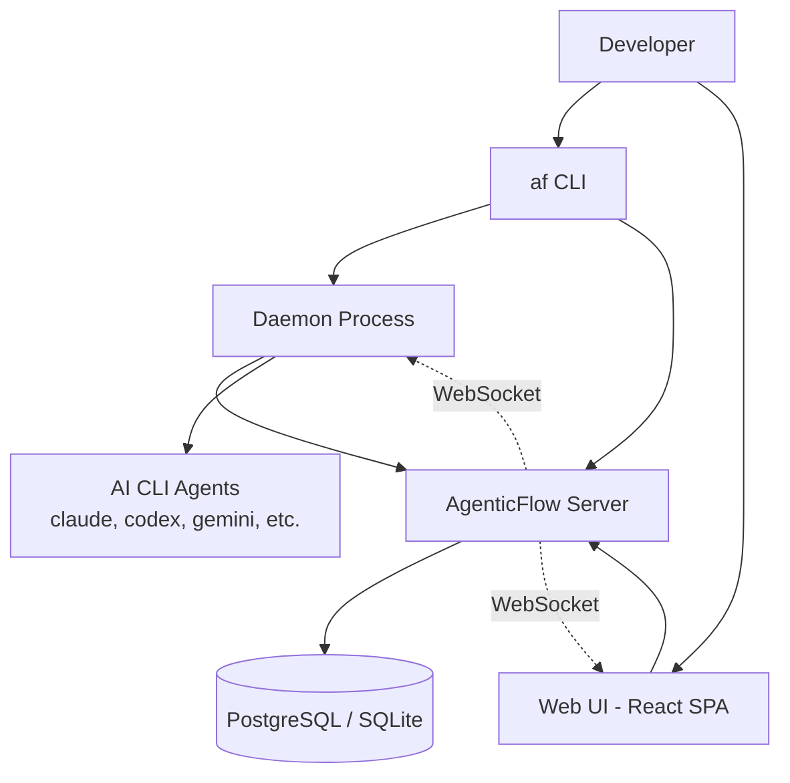
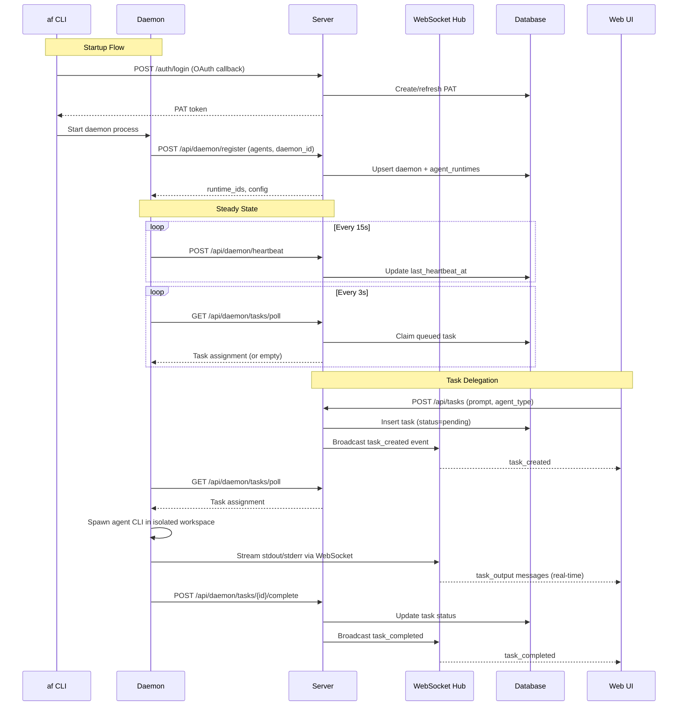

# Design Document: AgenticFlow Core

## Overview

AgenticFlow is a lightweight, self-hostable platform for detecting local AI CLI agent runtimes, managing a background daemon, and delegating tasks to detected agents via a minimal web interface. The architecture closely mirrors the [multica](https://github.com/multica-ai/multica) project, reusing proven patterns for daemon lifecycle, agent detection, task execution, and real-time communication — while stripping away workspace/team management, issue tracking, and other enterprise features to keep the system focused and minimal.

### Design Goals

- **Simplicity**: Single Go module, minimal dependencies, no Redis requirement for single-node
- **Multica-compatible patterns**: Reuse daemon detection, config resolution, task execution, and WebSocket streaming patterns
- **Self-hostable**: Single Docker container with PostgreSQL or SQLite
- **Lightweight frontend**: Vite + React SPA instead of a full Next.js monorepo

### System Context



## Architecture

### High-Level Architecture

The system consists of three main deployable components:

1. **Server** (`cmd/server/`) — HTTP API + WebSocket hub + static file server for the Web UI
2. **CLI + Daemon** (`cmd/af/`) — Single binary that handles both CLI commands and the background daemon process
3. **Web UI** (`web/`) — Vite + React SPA served by the Go server as static assets

### Project Structure

```
agenticflow/
├── cmd/
│   ├── af/              # CLI binary (login, daemon start/stop, config)
│   └── server/          # Server binary (HTTP API, WebSocket, migrations)
├── internal/
│   ├── auth/            # Token management, PAT hashing, OAuth flow
│   ├── cli/             # CLI config loading, profile management
│   ├── daemon/          # Daemon runtime: detection, lifecycle, execution
│   │   └── execenv/     # Task execution environment (workspace isolation)
│   ├── handler/         # HTTP route handlers
│   ├── middleware/      # Auth middleware, rate limiting
│   ├── realtime/        # WebSocket hub, client connections, broadcasting
│   └── service/         # Business logic (task assignment, agent registry)
├── migrations/          # SQL migration files (golang-migrate)
├── pkg/
│   └── db/
│       └── generated/   # sqlc-generated type-safe query code
├── web/                 # Vite + React + TypeScript SPA
│   ├── src/
│   │   ├── components/  # Reusable UI components
│   │   ├── pages/       # Route pages (Login, Dashboard, TaskDetail, etc.)
│   │   ├── hooks/       # React Query hooks, WebSocket hooks
│   │   └── lib/         # API client, WebSocket client, utilities
│   └── ...
├── go.mod
├── go.sum
├── Makefile
├── Dockerfile
└── docker-compose.yml
```

### Component Interaction Diagram



### Key Architectural Decisions

| Decision | Rationale |
|----------|-----------|
| Single Go module (no monorepo) | Simpler build, single `go build` for each binary |
| Chi router | Lightweight, composable middleware, same as multica |
| pgx/v5 + sqlc | Type-safe queries, connection pooling, same as multica |
| golang-migrate | Proven migration tool, supports both PostgreSQL and SQLite |
| In-memory caches (no Redis) | Single-node simplicity; Redis optional for multi-node |
| gorilla/websocket | Battle-tested WebSocket library, same as multica |
| Vite + React SPA | Fast dev experience, minimal bundle, no SSR complexity |
| React Query | Server state management with caching and invalidation |
| Tailwind CSS | Utility-first styling, fast iteration |

## Components and Interfaces

### 1. CLI (`cmd/af/`)

The CLI is the user-facing entry point. It handles authentication, daemon management, and configuration.

```go
// cmd/af/main.go — Cobra command tree
// af setup           → configure + login + daemon start
// af login           → browser OAuth or --token
// af auth status     → show auth state
// af auth logout     → remove PAT
// af daemon start    → start background daemon
// af daemon stop     → graceful shutdown
// af daemon status   → report daemon state
// af config show     → display config JSON
// af config set      → update config key
```

### 2. Daemon (`internal/daemon/`)

The daemon is the local agent runtime. It mirrors multica's daemon architecture.

```go
// internal/daemon/config.go
type Config struct {
    ServerURL          string
    DaemonID           string
    DeviceName         string
    Agents             map[string]AgentEntry // provider -> {path, model}
    WorkspacesRoot     string
    PollInterval       time.Duration // default 3s
    HeartbeatInterval  time.Duration // default 15s
    AgentTimeout       time.Duration // default 2h
    MaxConcurrentTasks int           // default 5
}

type AgentEntry struct {
    Path    string
    Model   string
    Version string
}

// LoadConfig resolves: CLI flags > env vars > config file > defaults
func LoadConfig(overrides Overrides) (Config, error)

// internal/daemon/daemon.go
type Daemon struct {
    cfg        Config
    client     *Client
    logger     *slog.Logger
    runtimes   map[string]string // runtimeID -> provider
    activeTasks atomic.Int64
}

func New(cfg Config, logger *slog.Logger) *Daemon
func (d *Daemon) Run(ctx context.Context) error
func (d *Daemon) Stop() error
```

**Detection Scanner** (mirrors multica's `probe()` pattern):

```go
// internal/daemon/detection.go
var knownAgents = []struct {
    Name    string
    Command string
    EnvPath string
    EnvModel string
}{
    {"claude", "claude", "AF_CLAUDE_PATH", "AF_CLAUDE_MODEL"},
    {"gemini", "gemini", "AF_GEMINI_PATH", "AF_GEMINI_MODEL"},
    {"opencode", "opencode", "AF_OPENCODE_PATH", "AF_OPENCODE_MODEL"},
    {"openclaw", "openclaw", "AF_OPENCLAW_PATH", "AF_OPENCLAW_MODEL"},
    {"codex", "codex", "AF_CODEX_PATH", "AF_CODEX_MODEL"},
    {"copilot", "copilot", "AF_COPILOT_PATH", "AF_COPILOT_MODEL"},
    {"hermes", "hermes", "AF_HERMES_PATH", "AF_HERMES_MODEL"},
    {"pi", "pi", "AF_PI_PATH", "AF_PI_MODEL"},
    {"cursor", "cursor-agent", "AF_CURSOR_PATH", "AF_CURSOR_MODEL"},
    {"kimi", "kimi", "AF_KIMI_PATH", "AF_KIMI_MODEL"},
    {"kiro", "kiro-cli", "AF_KIRO_PATH", "AF_KIRO_MODEL"},
}

func DetectAgents(overrides Overrides) (map[string]AgentEntry, error)
```

**Task Execution** (mirrors multica's `execenv/`):

```go
// internal/daemon/execenv/execenv.go
type ExecEnv struct {
    TaskID       string
    WorkspaceDir string
    Provider     string
    Prompt       string
    Model        string
    EnvVars      map[string]string
    ArgsTemplate string
}

func NewExecEnv(task Task, cfg Config) (*ExecEnv, error)
func (e *ExecEnv) Setup() error    // create workspace dir
func (e *ExecEnv) Cleanup() error  // remove workspace dir (after retention)
func (e *ExecEnv) Run(ctx context.Context, stdout, stderr io.Writer) (int, error)
```

### 3. Server (`cmd/server/`)

The server provides the HTTP API, WebSocket hub, and serves the Web UI.

```go
// cmd/server/main.go
func main() {
    // Load config from env
    // Run migrations
    // Initialize DB pool (pgx or SQLite)
    // Create WebSocket hub
    // Build router
    // Start HTTP server with graceful shutdown
}

// cmd/server/router.go
func NewRouter(pool *pgxpool.Pool, hub *realtime.Hub) chi.Router {
    r := chi.NewRouter()
    
    // Global middleware
    r.Use(middleware.RequestID)
    r.Use(middleware.CORS(allowedOrigins()))
    r.Use(middleware.Recoverer)
    
    // Health
    r.Get("/health", healthHandler)
    
    // Auth (public)
    r.Post("/auth/login", h.Login)
    r.Post("/auth/register", h.Register)
    r.Get("/auth/callback/{provider}", h.OAuthCallback)
    
    // WebSocket
    r.Get("/ws", h.WebSocket)
    
    // Daemon API (daemon token auth)
    r.Route("/api/daemon", func(r chi.Router) {
        r.Use(middleware.DaemonAuth(queries))
        r.Post("/register", h.DaemonRegister)
        r.Post("/deregister", h.DaemonDeregister)
        r.Post("/heartbeat", h.DaemonHeartbeat)
        r.Get("/tasks/poll", h.PollTasks)
        r.Post("/tasks/{taskId}/start", h.StartTask)
        r.Post("/tasks/{taskId}/complete", h.CompleteTask)
        r.Post("/tasks/{taskId}/fail", h.FailTask)
        r.Post("/tasks/{taskId}/messages", h.ReportTaskMessages)
    })
    
    // Protected API (user PAT auth)
    r.Group(func(r chi.Router) {
        r.Use(middleware.Auth(queries, patCache))
        
        r.Get("/api/me", h.GetMe)
        r.Get("/api/daemons", h.ListDaemons)
        r.Get("/api/agents", h.ListAgentRuntimes)
        
        // Tasks
        r.Post("/api/tasks", h.CreateTask)
        r.Get("/api/tasks", h.ListTasks)
        r.Get("/api/tasks/{taskId}", h.GetTask)
        r.Get("/api/tasks/{taskId}/messages", h.ListTaskMessages)
        r.Post("/api/tasks/{taskId}/cancel", h.CancelTask)
        
        // Custom Agents
        r.Post("/api/custom-agents", h.CreateCustomAgent)
        r.Get("/api/custom-agents", h.ListCustomAgents)
        r.Put("/api/custom-agents/{id}", h.UpdateCustomAgent)
        r.Delete("/api/custom-agents/{id}", h.DeleteCustomAgent)
        
        // Tokens
        r.Get("/api/tokens", h.ListTokens)
        r.Post("/api/tokens", h.CreateToken)
        r.Delete("/api/tokens/{id}", h.RevokeToken)
    })
    
    // Static files (Web UI)
    r.Handle("/*", http.FileServer(http.Dir("./web/dist")))
    
    return r
}
```

### 4. Real-time Hub (`internal/realtime/`)

WebSocket hub for broadcasting events to connected clients and daemons.

```go
// internal/realtime/hub.go
type Hub struct {
    clients    map[string]*Client  // userID -> client
    daemons    map[string]*Client  // daemonID -> client
    broadcast  chan Event
    register   chan *Client
    unregister chan *Client
}

type Event struct {
    Type    string      `json:"type"`
    Payload interface{} `json:"payload"`
    UserID  string      `json:"-"` // target user (empty = broadcast)
}

func NewHub() *Hub
func (h *Hub) Run(ctx context.Context)
func (h *Hub) Broadcast(event Event)
func (h *Hub) SendToUser(userID string, event Event)
func (h *Hub) SendToDaemon(daemonID string, event Event)
```

### 5. Authentication (`internal/auth/`)

```go
// internal/auth/pat.go
const PATPrefix = "af_"
const PATExpiry = 90 * 24 * time.Hour // 90 days

func GeneratePAT() (token string, hash string)
func HashToken(token string) string
func ValidatePAT(ctx context.Context, queries *db.Queries, token string) (userID string, err error)

// internal/auth/oauth.go
type OAuthConfig struct {
    Provider     string // "github" or "google"
    ClientID     string
    ClientSecret string
    RedirectURL  string
}

func NewOAuthHandler(cfg OAuthConfig) *OAuthHandler
```

### 6. Web UI (`web/`)

Minimal React SPA with the following pages:

| Page | Route | Description |
|------|-------|-------------|
| Login | `/login` | OAuth or email/password login |
| Dashboard | `/` | Daemons, agents, task queue overview |
| Task Detail | `/tasks/:id` | Streaming output, status, metadata |
| Custom Agents | `/agents` | Create/edit/delete custom agents |
| Task History | `/history` | Paginated task list with filters |

**Key frontend libraries:**
- `@tanstack/react-query` — server state management
- `tailwindcss` — utility-first CSS
- Native WebSocket API — real-time updates
- `react-router-dom` — client-side routing

## Data Models

### Database Schema (PostgreSQL)

```sql
-- Users
CREATE TABLE "user" (
    id UUID PRIMARY KEY DEFAULT gen_random_uuid(),
    name TEXT NOT NULL,
    email TEXT UNIQUE NOT NULL,
    password_hash TEXT,          -- NULL for OAuth-only users
    avatar_url TEXT,
    created_at TIMESTAMPTZ NOT NULL DEFAULT now(),
    updated_at TIMESTAMPTZ NOT NULL DEFAULT now()
);

-- Personal Access Tokens
CREATE TABLE personal_access_token (
    id UUID PRIMARY KEY DEFAULT gen_random_uuid(),
    user_id UUID NOT NULL REFERENCES "user"(id) ON DELETE CASCADE,
    name TEXT NOT NULL,
    token_hash TEXT UNIQUE NOT NULL,
    expires_at TIMESTAMPTZ NOT NULL,
    last_used_at TIMESTAMPTZ,
    created_at TIMESTAMPTZ NOT NULL DEFAULT now()
);

-- Daemons
CREATE TABLE daemon (
    id UUID PRIMARY KEY DEFAULT gen_random_uuid(),
    user_id UUID NOT NULL REFERENCES "user"(id) ON DELETE CASCADE,
    daemon_id TEXT NOT NULL,     -- machine-stable identifier
    device_name TEXT NOT NULL,
    status TEXT NOT NULL DEFAULT 'offline'
        CHECK (status IN ('online', 'offline')),
    last_heartbeat_at TIMESTAMPTZ,
    cli_version TEXT,
    created_at TIMESTAMPTZ NOT NULL DEFAULT now(),
    updated_at TIMESTAMPTZ NOT NULL DEFAULT now(),
    UNIQUE(user_id, daemon_id)
);

-- Agent Runtimes (detected CLIs per daemon)
CREATE TABLE agent_runtime (
    id UUID PRIMARY KEY DEFAULT gen_random_uuid(),
    daemon_id UUID NOT NULL REFERENCES daemon(id) ON DELETE CASCADE,
    provider TEXT NOT NULL,      -- claude, codex, gemini, etc.
    name TEXT NOT NULL,          -- display name
    version TEXT,
    binary_path TEXT,
    status TEXT NOT NULL DEFAULT 'available'
        CHECK (status IN ('available', 'busy', 'unavailable')),
    created_at TIMESTAMPTZ NOT NULL DEFAULT now(),
    updated_at TIMESTAMPTZ NOT NULL DEFAULT now(),
    UNIQUE(daemon_id, provider)
);

-- Custom Agents
CREATE TABLE custom_agent (
    id UUID PRIMARY KEY DEFAULT gen_random_uuid(),
    user_id UUID NOT NULL REFERENCES "user"(id) ON DELETE CASCADE,
    name TEXT NOT NULL CHECK (name ~ '^[a-zA-Z0-9_-]{1,64}$'),
    command TEXT NOT NULL,
    args_template TEXT NOT NULL DEFAULT '{{prompt}}',
    model_override TEXT,
    env_vars JSONB NOT NULL DEFAULT '{}',
    created_at TIMESTAMPTZ NOT NULL DEFAULT now(),
    updated_at TIMESTAMPTZ NOT NULL DEFAULT now(),
    UNIQUE(user_id, name)
);

-- Tasks
CREATE TABLE task (
    id UUID PRIMARY KEY DEFAULT gen_random_uuid(),
    user_id UUID NOT NULL REFERENCES "user"(id) ON DELETE CASCADE,
    agent_type TEXT NOT NULL,        -- provider name or custom_agent name
    agent_runtime_id UUID REFERENCES agent_runtime(id),
    custom_agent_id UUID REFERENCES custom_agent(id),
    daemon_id UUID REFERENCES daemon(id),
    prompt TEXT NOT NULL CHECK (char_length(prompt) <= 32000),
    status TEXT NOT NULL DEFAULT 'pending'
        CHECK (status IN ('pending', 'running', 'completed', 'failed', 'cancelled', 'timeout')),
    exit_code INT,
    error_message TEXT,
    output_preview TEXT,            -- first 1024 chars of output
    started_at TIMESTAMPTZ,
    completed_at TIMESTAMPTZ,
    created_at TIMESTAMPTZ NOT NULL DEFAULT now(),
    updated_at TIMESTAMPTZ NOT NULL DEFAULT now()
);

-- Task Messages (streaming output)
CREATE TABLE task_message (
    id UUID PRIMARY KEY DEFAULT gen_random_uuid(),
    task_id UUID NOT NULL REFERENCES task(id) ON DELETE CASCADE,
    sequence INT NOT NULL,
    stream TEXT NOT NULL CHECK (stream IN ('stdout', 'stderr')),
    content TEXT NOT NULL,
    created_at TIMESTAMPTZ NOT NULL DEFAULT now()
);

-- Indexes
CREATE INDEX idx_daemon_user ON daemon(user_id);
CREATE INDEX idx_daemon_status ON daemon(status);
CREATE INDEX idx_agent_runtime_daemon ON agent_runtime(daemon_id);
CREATE INDEX idx_agent_runtime_provider ON agent_runtime(provider);
CREATE INDEX idx_custom_agent_user ON custom_agent(user_id);
CREATE INDEX idx_task_user ON task(user_id);
CREATE INDEX idx_task_status ON task(status);
CREATE INDEX idx_task_agent_type ON task(agent_type);
CREATE INDEX idx_task_message_task ON task_message(task_id, sequence);
```

### SQLite Schema Differences

For single-user SQLite mode, the schema uses `INTEGER PRIMARY KEY` with `hex(randomblob(16))` for UUID generation and `TEXT` for timestamps (ISO 8601 format). The migration system detects the database driver and applies the appropriate schema variant.

### Configuration File Schema

```json
// ~/.agenticflow/config.json
{
    "server_url": "http://localhost:8080",
    "token": "af_...",
    "token_expires_at": "2025-09-15T00:00:00Z",
    "user_email": "user@example.com",
    "poll_interval": "3s",
    "heartbeat_interval": "15s",
    "agent_timeout": "2h",
    "max_concurrent_tasks": 5
}
```

### Key Data Types

```go
// internal/daemon/types.go
type Task struct {
    ID           string            `json:"id"`
    AgentType    string            `json:"agent_type"`
    Prompt       string            `json:"prompt"`
    Model        string            `json:"model,omitempty"`
    ArgsTemplate string            `json:"args_template,omitempty"`
    EnvVars      map[string]string `json:"env_vars,omitempty"`
    WorkspaceDir string            `json:"workspace_dir,omitempty"`
}

type TaskResult struct {
    Status      string `json:"status"` // completed, failed, timeout
    ExitCode    int    `json:"exit_code"`
    Output      string `json:"output,omitempty"`
    Error       string `json:"error,omitempty"`
}

// WebSocket event types
type WSEvent struct {
    Type    string          `json:"type"`
    Payload json.RawMessage `json:"payload"`
}

// Event types: task_created, task_started, task_output, task_completed,
//              task_failed, daemon_connected, daemon_disconnected
```


## Correctness Properties

*A property is a characteristic or behavior that should hold true across all valid executions of a system — essentially, a formal statement about what the system should do. Properties serve as the bridge between human-readable specifications and machine-verifiable correctness guarantees.*

### Property 1: Agent Detection with Precedence

*For any* set of agent configurations (combining PATH availability and `AF_<AGENT_NAME>_PATH` environment variables), the Detection Scanner SHALL return exactly the agents whose binary exists at either the custom path (if set) or on the system PATH, with custom paths taking precedence over PATH lookup. Each returned agent entry SHALL contain a non-empty name, binary path, and version (or "unknown").

**Validates: Requirements 1.1, 1.5, 1.6, 1.7, 1.8**

### Property 2: Agent Deregistration Equals Scan Difference

*For any* two consecutive detection scans producing agent sets A (before) and B (after), the set of agents deregistered SHALL equal A \ B (agents in A but not in B), and the set of agents newly registered SHALL equal B \ A.

**Validates: Requirements 1.4**

### Property 3: Configuration Resolution Precedence

*For any* configuration key with values specified at multiple levels (CLI flag, environment variable, config file, default), the resolved value SHALL equal the highest-precedence source: flags > environment variables > config file > defaults.

**Validates: Requirements 2.8**

### Property 4: Configuration Serialization Round-Trip

*For any* valid configuration object, serializing it to JSON and parsing the result back SHALL produce a deeply equal configuration object.

**Validates: Requirements 9.4**

### Property 5: Configuration Value Validation

*For any* configuration key and value pair, the CLI SHALL accept the write if and only if: `server_url` is a valid URL with http/https scheme, `poll_interval` is a duration in [1s, 300s], `heartbeat_interval` is a duration in [5s, 300s], `agent_timeout` is a duration in [1m, 24h], and `max_concurrent_tasks` is an integer in [1, 100]. Invalid values SHALL leave the config file unchanged.

**Validates: Requirements 9.6, 9.7**

### Property 6: Task Prompt Validation

*For any* string submitted as a task prompt, the Server SHALL accept it if and only if it is non-empty, non-whitespace-only, and does not exceed 32,000 characters.

**Validates: Requirements 4.6, 6.3**

### Property 7: Task Assignment Matching

*For any* queued task with a specified agent type, the Server SHALL assign it only to a Daemon that has a registered Agent_Runtime matching that agent type. Tasks with no matching online Daemon SHALL remain in pending status.

**Validates: Requirements 4.7**

### Property 8: Concurrent Task Polling Suppression

*For any* Daemon state where the number of active tasks equals the configured `max_concurrent_tasks`, the Daemon SHALL skip task polling. When active tasks drop below the limit, polling SHALL resume.

**Validates: Requirements 4.8**

### Property 9: Output Truncation

*For any* task output exceeding 1 MB, the reported output SHALL be truncated to exactly 1 MB. *For any* stderr output exceeding 4,096 characters, the reported error SHALL contain exactly the last 4,096 characters of stderr.

**Validates: Requirements 4.4, 4.9**

### Property 10: Workspace Isolation

*For any* set of concurrently executing tasks, each task's workspace directory SHALL be located at `~/.agenticflow/workspaces/<task-id>/` where task-id is unique, and no two task workspace paths SHALL share any filesystem path beyond the workspaces root directory.

**Validates: Requirements 10.1, 10.4, 4.2**

### Property 11: Template Variable Substitution

*For any* arguments template containing `{{prompt}}`, `{{workspace}}`, and/or `{{model}}` placeholders, and any set of variable values, the resolved string SHALL have all recognized placeholders replaced with their corresponding values. `{{model}}` SHALL resolve to empty string when no model override is set.

**Validates: Requirements 5.4**

### Property 12: Custom Agent Name Validation

*For any* string submitted as a Custom Agent name, the Server SHALL accept it if and only if it matches the pattern `^[a-zA-Z0-9_-]{1,64}$`.

**Validates: Requirements 5.1**

### Property 13: PAT Authentication Enforcement

*For any* API request with a missing, malformed, or expired PAT in the Authorization header, the Server SHALL respond with HTTP 401.

**Validates: Requirements 7.4**

### Property 14: Daemon Offline Detection

*For any* Daemon whose `last_heartbeat_at` timestamp is older than 3 × heartbeat_interval (default 45 seconds), the Server SHALL mark the daemon as offline and deregister its Agent_Runtimes.

**Validates: Requirements 7.7**

### Property 15: Password Validation

*For any* password string submitted during email/password registration, the Server SHALL accept it if and only if its length is at least 8 characters.

**Validates: Requirements 8.5**

### Property 16: Token Storage Round-Trip

*For any* valid PAT token, storing it in `~/.agenticflow/config.json` and reading it back SHALL produce the identical token string with the correct 90-day expiry timestamp.

**Validates: Requirements 3.3**

### Property 17: Daemon Status Output Completeness

*For any* daemon state (running or stopped), the `af daemon status` output SHALL contain: running state, PID (if running), uptime, list of detected Agent_Runtimes with names, and heartbeat status with last timestamp and connection state.

**Validates: Requirements 2.4**

## Error Handling

### Daemon Error Handling

| Error Scenario | Handling Strategy |
|----------------|-------------------|
| No agents detected on PATH | Log warning, continue running (wait for agents to be installed) |
| Server unreachable during heartbeat | Retry 3× with 5s delay, log warning, continue |
| WebSocket disconnect during task | Buffer output locally (up to 5MB), reconnect at 5s intervals |
| Task agent process timeout | SIGTERM → wait 10s → SIGKILL, report timeout to server |
| Task agent exits non-zero | Report failure with exit code + last 4096 chars stderr |
| Workspace creation fails (filesystem) | Transition task to failed, report error to server |
| Config file corrupt/missing | Create default config, log warning |
| PID file stale on startup | Clean up stale PID, proceed with startup |
| Auth token expired | Auto-refresh if within 7 days of expiry; prompt re-login if refresh fails |

### Server Error Handling

| Error Scenario | Handling Strategy |
|----------------|-------------------|
| Database unreachable on startup | Log error, exit with non-zero code within 10s |
| Invalid PAT on API request | Return HTTP 401 with error message |
| Invalid WebSocket auth | Reject with close frame + error message |
| Task prompt exceeds 32000 chars | Return HTTP 400 with validation error |
| Custom agent name conflict | Return HTTP 409 with conflict error |
| Daemon misses 3 heartbeats (45s) | Mark offline, deregister runtimes |
| SIGTERM received | Stop accepting connections, drain in-flight within 30s, shutdown |
| Migration failure | Log error, exit with non-zero code |

### Web UI Error Handling

| Error Scenario | Handling Strategy |
|----------------|-------------------|
| WebSocket disconnect | Show connection indicator, reconnect at 5s intervals |
| Auth failure / session expired | Redirect to login page with error message |
| API request failure | Show toast notification with error, retry with exponential backoff |
| Form validation failure | Inline error messages, prevent submission |

## Testing Strategy

### Dual Testing Approach

The testing strategy combines property-based tests for universal correctness guarantees with example-based tests for specific scenarios and integration points.

### Property-Based Tests (Go)

**Library**: [rapid](https://github.com/flyingmutant/rapid) (Go property-based testing library)

**Configuration**: Minimum 100 iterations per property test.

**Tag format**: Each test is tagged with a comment referencing the design property:
```go
// Feature: agenticflow-core, Property 1: Agent detection with precedence
```

Properties to implement:
1. Agent detection with precedence (Property 1)
2. Agent deregistration difference (Property 2)
3. Config resolution precedence (Property 3)
4. Config serialization round-trip (Property 4)
5. Config value validation (Property 5)
6. Task prompt validation (Property 6)
7. Task assignment matching (Property 7)
8. Concurrent task polling suppression (Property 8)
9. Output truncation (Property 9)
10. Workspace isolation (Property 10)
11. Template variable substitution (Property 11)
12. Custom agent name validation (Property 12)
13. PAT authentication enforcement (Property 13)
14. Daemon offline detection (Property 14)
15. Password validation (Property 15)
16. Token storage round-trip (Property 16)
17. Status output completeness (Property 17)

### Unit Tests (Go)

Focus areas:
- Specific examples for each handler (happy path + error cases)
- Edge cases: empty inputs, boundary values, Unicode, special characters
- Mock-based tests for external dependencies (exec.LookPath, filesystem)
- Database query tests with test fixtures

### Integration Tests

Focus areas:
- Full daemon lifecycle (start → detect → register → poll → execute → stop)
- WebSocket streaming end-to-end
- OAuth flow with mock provider
- Docker deployment smoke test
- Database migration up/down cycle

### Frontend Tests (Vitest + React Testing Library)

Focus areas:
- Component rendering with mock data
- Form validation behavior
- WebSocket event handling
- Authentication redirect logic
- React Query cache invalidation on WebSocket events

### Test Commands

```bash
# Go unit + property tests
go test ./...

# Go tests with race detector
go test -race ./...

# Frontend tests
cd web && npm run test

# Integration tests (requires Docker)
make test-integration

# Full CI pipeline
make check
```
