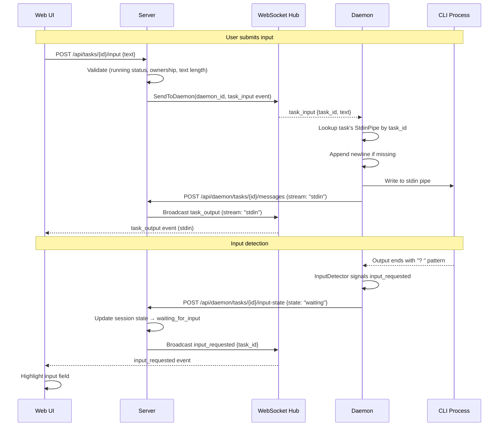
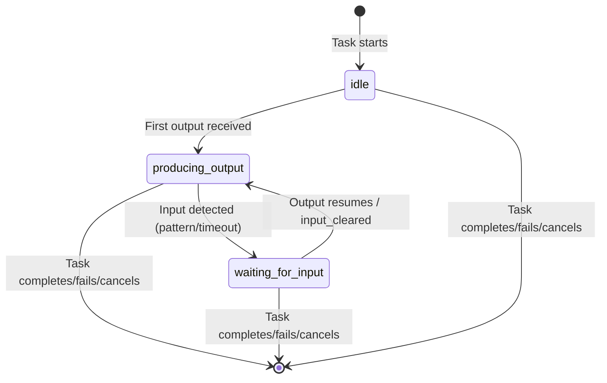
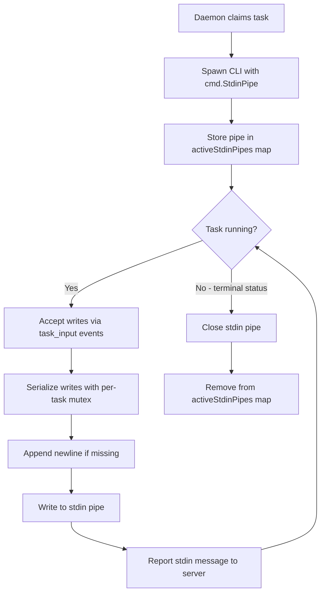

# Design Document: Interactive Task Sessions

## Overview

Interactive Task Sessions extends AgenticFlow's task execution model from one-shot (fire-and-forget) to bidirectional. Currently, the daemon spawns a CLI process with a prompt, streams stdout/stderr to the web UI via WebSocket, and reports completion — but there is no mechanism to send input back to the running process. This feature adds a bidirectional stdin pipe so users can respond to CLI questions (permission prompts, clarification requests) directly from the web UI during task execution.

### Design Goals

- **Bidirectional communication**: Enable Web UI → Server → Daemon → CLI stdin data flow
- **Input detection**: Automatically detect when a CLI process is waiting for user input
- **Session state tracking**: Maintain and broadcast whether a task is producing output or waiting for input
- **Full interaction history**: Persist stdin messages alongside stdout/stderr for complete audit trail
- **Task isolation**: Ensure input for one task never reaches another task's process

### Key Design Decisions

| Decision | Rationale |
|----------|-----------|
| Server relays input via WebSocket `SendToDaemon` | Daemon already has a WebSocket connection to the hub; avoids new polling endpoint |
| Input detection via pattern matching + inactivity timeout | Covers both explicit prompts ("?", ": ") and implicit waits; configurable |
| Session state stored in-memory (not DB) | Ephemeral runtime state; cleared on task completion; no persistence needed |
| Stdin messages stored as stream type "stdin" in existing `task_message` table | Reuses existing infrastructure; maintains chronological ordering via sequence numbers |
| Newline appending on daemon side | CLI processes expect line-terminated input; daemon is closest to the pipe |
| Mutex-based write serialization per task | Simple, correct; avoids interleaved writes from concurrent input submissions |

## Architecture

### Bidirectional Communication Flow



### Session State Machine



### Daemon Stdin Pipe Lifecycle



## Components and Interfaces

### 1. Server: Task Input Handler (`internal/handler/task_input.go`)

New handler for the `POST /api/tasks/{id}/input` endpoint.

```go
// internal/handler/task_input.go

const (
    maxInputTextLength = 10000
)

// TaskInputRequest is the request body for POST /api/tasks/{id}/input.
type TaskInputRequest struct {
    Text string `json:"text"`
}

// TaskInputResponse is the response for successful input relay.
type TaskInputResponse struct {
    Status    string `json:"status"`    // "delivered"
    TaskID    string `json:"task_id"`
    Timestamp string `json:"timestamp"`
}

// SendTaskInput handles POST /api/tasks/{id}/input.
// Validates the request, checks task ownership and status, then relays
// the input to the daemon via WebSocket.
func (h *Handler) SendTaskInput(w http.ResponseWriter, r *http.Request) {
    taskID := chi.URLParam(r, "id")
    // 1. Parse and validate request body
    // 2. Validate text: non-empty, <= 10000 chars
    // 3. Load task from DB, verify ownership (user_id matches)
    // 4. Verify task status == "running"
    //    - If not running: return 409
    // 5. Resolve daemon_id from task's daemon assignment
    //    - If daemon offline: return 502
    // 6. Send task_input event to daemon via Hub.SendToDaemon()
    // 7. Return 202 with confirmation
}
```

**API Route** (added to the protected group in `cmd/server/router.go`):

```go
r.Post("/api/tasks/{id}/input", h.SendTaskInput)
```

### 2. Server: Session State Manager (`internal/service/session_state.go`)

In-memory session state tracking for running tasks.

```go
// internal/service/session_state.go

// SessionState represents the interaction state of a running task.
type SessionState string

const (
    SessionStateIdle            SessionState = "idle"
    SessionStateProducingOutput SessionState = "producing_output"
    SessionStateWaitingForInput SessionState = "waiting_for_input"
)

// SessionStateManager tracks the interaction state of running tasks.
// State is ephemeral (in-memory only) and cleared on task completion.
type SessionStateManager struct {
    mu     sync.RWMutex
    states map[string]SessionState // task_id -> state
    hub    *realtime.Hub
}

// NewSessionStateManager creates a new manager.
func NewSessionStateManager(hub *realtime.Hub) *SessionStateManager {
    return &SessionStateManager{
        states: make(map[string]SessionState),
        hub:    hub,
    }
}

// SetState updates the session state for a task and broadcasts the change.
func (m *SessionStateManager) SetState(taskID string, state SessionState) {
    m.mu.Lock()
    prev := m.states[taskID]
    m.states[taskID] = state
    m.mu.Unlock()

    if prev != state {
        m.hub.Broadcast(realtime.Event{
            Type: "session_state_changed",
            Payload: map[string]interface{}{
                "task_id": taskID,
                "state":   string(state),
            },
        })
    }
}

// GetState returns the current session state for a task.
func (m *SessionStateManager) GetState(taskID string) SessionState {
    m.mu.RLock()
    defer m.mu.RUnlock()
    state, ok := m.states[taskID]
    if !ok {
        return SessionStateIdle
    }
    return state
}

// ClearState removes the session state for a task (on terminal transition).
func (m *SessionStateManager) ClearState(taskID string) {
    m.mu.Lock()
    delete(m.states, taskID)
    m.mu.Unlock()
}
```

### 3. Server: Daemon Input State Handler (`internal/handler/daemon.go` extension)

New endpoint for the daemon to report input detection state changes.

```go
// Added to internal/handler/daemon.go

// TaskInputStateReq is the request body for POST /api/daemon/tasks/{taskId}/input-state.
type TaskInputStateReq struct {
    State string `json:"state"` // "waiting" or "cleared"
}

// ReportInputState handles POST /api/daemon/tasks/{taskId}/input-state.
// Called by the daemon when the InputDetector signals a state change.
func (h *DaemonHandler) ReportInputState(w http.ResponseWriter, r *http.Request) {
    taskID := chi.URLParam(r, "taskId")
    // 1. Parse request body
    // 2. Validate state is "waiting" or "cleared"
    // 3. Update SessionStateManager:
    //    - "waiting" → SetState(taskID, SessionStateWaitingForInput)
    //    - "cleared" → SetState(taskID, SessionStateProducingOutput)
    // 4. Broadcast appropriate WebSocket event:
    //    - "waiting" → input_requested {task_id}
    //    - "cleared" → input_cleared {task_id}
    // 5. Return 200
}
```

**API Route**:

```go
r.Post("/api/daemon/tasks/{taskId}/input-state", dh.ReportInputState)
```

### 4. Daemon: Stdin Pipe Manager (`internal/daemon/stdin.go`)

Manages stdin pipes for all active tasks with per-task write serialization.

```go
// internal/daemon/stdin.go

// StdinPipeManager manages stdin pipes for active tasks.
// It provides thread-safe write access with per-task serialization.
type StdinPipeManager struct {
    mu    sync.RWMutex
    pipes map[string]*taskStdinPipe // task_id -> pipe
}

type taskStdinPipe struct {
    pipe   io.WriteCloser
    mu     sync.Mutex // serializes writes to this specific pipe
    closed bool
}

// NewStdinPipeManager creates a new manager.
func NewStdinPipeManager() *StdinPipeManager {
    return &StdinPipeManager{
        pipes: make(map[string]*taskStdinPipe),
    }
}

// Register stores a stdin pipe for a task. Called when the CLI process is spawned.
func (m *StdinPipeManager) Register(taskID string, pipe io.WriteCloser) {
    m.mu.Lock()
    defer m.mu.Unlock()
    m.pipes[taskID] = &taskStdinPipe{pipe: pipe}
}

// Write writes text to the task's stdin pipe with newline appending.
// Returns an error if the task is not found or the pipe is broken.
func (m *StdinPipeManager) Write(taskID string, text string) error {
    m.mu.RLock()
    tp, ok := m.pipes[taskID]
    m.mu.RUnlock()

    if !ok {
        return fmt.Errorf("stdin: no pipe for task %s", taskID)
    }

    tp.mu.Lock()
    defer tp.mu.Unlock()

    if tp.closed {
        return fmt.Errorf("stdin: pipe closed for task %s", taskID)
    }

    // Append newline if text doesn't already end with one.
    data := EnsureNewline(text)

    _, err := tp.pipe.Write([]byte(data))
    if err != nil {
        return fmt.Errorf("stdin: write failed for task %s: %w", taskID, err)
    }
    return nil
}

// Close closes the stdin pipe for a task and removes it from the map.
func (m *StdinPipeManager) Close(taskID string) {
    m.mu.Lock()
    tp, ok := m.pipes[taskID]
    if ok {
        delete(m.pipes, taskID)
    }
    m.mu.Unlock()

    if ok && !tp.closed {
        tp.mu.Lock()
        tp.closed = true
        tp.pipe.Close()
        tp.mu.Unlock()
    }
}

// EnsureNewline appends a newline to text if it doesn't already end with one.
func EnsureNewline(text string) string {
    if text == "" {
        return "\n"
    }
    if text[len(text)-1] != '\n' {
        return text + "\n"
    }
    return text
}
```

### 5. Daemon: Input Detector (`internal/daemon/inputdetect.go`)

Analyzes CLI output to detect when the process is waiting for user input.

```go
// internal/daemon/inputdetect.go

// DefaultPromptPatterns are the built-in patterns that indicate input is expected.
var DefaultPromptPatterns = []string{
    "? ",    // Question mark followed by space (common prompt)
    ": ",    // Colon followed by space (password/input prompts)
    "> ",    // Greater-than followed by space (shell-like prompts)
    "$ ",    // Dollar followed by space (shell prompts)
    "?",     // Line ending with question mark
}

// InputDetectorConfig holds configuration for the input detector.
type InputDetectorConfig struct {
    InactivityTimeout  time.Duration // Default 10s, min 3s, max 60s
    AdditionalPatterns []string      // Extra patterns from daemon config
}

// InputDetector monitors CLI output and signals when input is likely expected.
type InputDetector struct {
    config       InputDetectorConfig
    patterns     []string // merged default + additional patterns
    lastOutput   time.Time
    waiting      atomic.Bool
    timer        *time.Timer
    mu           sync.Mutex
    onWaiting    func() // callback when input is detected
    onCleared    func() // callback when input state is cleared
}

// NewInputDetector creates a detector with the given config and callbacks.
func NewInputDetector(cfg InputDetectorConfig, onWaiting, onCleared func()) *InputDetector {
    patterns := append(DefaultPromptPatterns, cfg.AdditionalPatterns...)
    timeout := cfg.InactivityTimeout
    if timeout < 3*time.Second {
        timeout = 3 * time.Second
    }
    if timeout > 60*time.Second {
        timeout = 60 * time.Second
    }
    if timeout == 0 {
        timeout = 10 * time.Second
    }

    return &InputDetector{
        config:    InputDetectorConfig{InactivityTimeout: timeout, AdditionalPatterns: cfg.AdditionalPatterns},
        patterns:  patterns,
        onWaiting: onWaiting,
        onCleared: onCleared,
    }
}

// OnOutput is called each time the CLI produces output.
// It checks for prompt patterns and resets the inactivity timer.
func (d *InputDetector) OnOutput(content string) {
    d.mu.Lock()
    defer d.mu.Unlock()

    d.lastOutput = time.Now()

    // If we were waiting, clear the state (output resumed).
    if d.waiting.Load() {
        d.waiting.Store(false)
        if d.onCleared != nil {
            go d.onCleared()
        }
    }

    // Reset inactivity timer.
    d.resetTimer()

    // Check if output ends with a prompt pattern.
    if d.matchesPromptPattern(content) {
        d.signalWaiting()
    }
}

// matchesPromptPattern checks if the content ends with a recognized prompt.
func (d *InputDetector) matchesPromptPattern(content string) bool {
    trimmed := strings.TrimRight(content, "\r\n")
    for _, pattern := range d.patterns {
        if strings.HasSuffix(trimmed, pattern) {
            return true
        }
    }
    return false
}

// signalWaiting transitions to the waiting state.
func (d *InputDetector) signalWaiting() {
    if !d.waiting.Load() {
        d.waiting.Store(true)
        if d.onWaiting != nil {
            go d.onWaiting()
        }
    }
}

// Stop cleans up the detector's timer.
func (d *InputDetector) Stop() {
    d.mu.Lock()
    defer d.mu.Unlock()
    if d.timer != nil {
        d.timer.Stop()
    }
    // Clear waiting state on process exit.
    if d.waiting.Load() {
        d.waiting.Store(false)
        if d.onCleared != nil {
            go d.onCleared()
        }
    }
}
```

### 6. Daemon: ExecEnv Changes (`internal/daemon/execenv/execenv.go`)

The `Run` method is modified to create a stdin pipe and return it alongside the existing stdout/stderr writers.

```go
// Modified Run signature in execenv.go

// RunWithStdin spawns the agent CLI process with stdin pipe support.
// Returns the stdin pipe writer, exit code, and any error.
// The caller is responsible for closing the stdin pipe on task completion.
func (e *ExecEnv) RunWithStdin(ctx context.Context, stdout, stderr io.Writer) (io.WriteCloser, int, error) {
    args := buildProviderArgs(e.Provider, e.Prompt, e.WorkspaceDir, e.Model, e.ArgsTemplate, e.SystemPrompt, e.CustomArgs)

    cmd := exec.CommandContext(ctx, e.BinaryPath, args...)
    cmd.Dir = e.WorkspaceDir
    cmd.Stdout = stdout
    cmd.Stderr = stderr

    // Create stdin pipe for bidirectional communication.
    stdinPipe, err := cmd.StdinPipe()
    if err != nil {
        return nil, -1, fmt.Errorf("execenv: create stdin pipe: %w", err)
    }

    // ... (same env setup and process management as existing Run method)

    if err := cmd.Start(); err != nil {
        stdinPipe.Close()
        return nil, -1, fmt.Errorf("execenv: start process: %w", err)
    }

    return stdinPipe, 0, nil // exit code determined after Wait()
}
```

### 7. Daemon: WebSocket Event Handling for Input

The daemon listens for `task_input` events on its WebSocket connection.

```go
// internal/daemon/daemon.go (addition to WebSocket message handler)

// handleWSMessage processes incoming WebSocket messages from the server.
func (d *Daemon) handleWSMessage(msg []byte) {
    var event struct {
        Type    string          `json:"type"`
        Payload json.RawMessage `json:"payload"`
    }
    if err := json.Unmarshal(msg, &event); err != nil {
        d.logger.Warn("invalid WS message", "error", err)
        return
    }

    switch event.Type {
    case "task_input":
        var payload struct {
            TaskID string `json:"task_id"`
            Text   string `json:"text"`
        }
        if err := json.Unmarshal(event.Payload, &payload); err != nil {
            d.logger.Warn("invalid task_input payload", "error", err)
            return
        }
        d.handleTaskInput(payload.TaskID, payload.Text)
    }
}

// handleTaskInput writes user input to the task's stdin pipe.
func (d *Daemon) handleTaskInput(taskID, text string) {
    logger := d.logger.With("task_id", taskID)

    if err := d.stdinManager.Write(taskID, text); err != nil {
        logger.Warn("failed to write task input", "error", err)
        // Report failure to server.
        d.reportInputFailure(taskID, err.Error())
        return
    }

    // Report the stdin message to the server for persistence and broadcast.
    msg := TaskMessage{
        Sequence: d.nextSequence(taskID),
        Stream:   "stdin",
        Content:  text,
    }
    if err := d.client.ReportMessages(context.Background(), taskID, []TaskMessage{msg}); err != nil {
        logger.Warn("failed to report stdin message", "error", err)
    }
}
```

### 8. Web UI: Task Input Component (`web/src/components/TaskInput.tsx`)

Input field component displayed on the task detail page when a task is running.

```typescript
// web/src/components/TaskInput.tsx

interface TaskInputProps {
  taskId: string;
  isRunning: boolean;
  isWaitingForInput: boolean;
}

export function TaskInput({ taskId, isRunning, isWaitingForInput }: TaskInputProps) {
  const [text, setText] = useState("");
  const sendInput = useSendTaskInput();

  if (!isRunning) return null;

  const handleSubmit = async (e: FormEvent) => {
    e.preventDefault();
    if (!text.trim() || sendInput.isPending) return;

    sendInput.mutate(
      { taskId, text },
      {
        onSuccess: () => setText(""),
        // onError: preserve text, show error
      }
    );
  };

  return (
    <form onSubmit={handleSubmit} className="mt-2 flex gap-2">
      <input
        type="text"
        value={text}
        onChange={(e) => setText(e.target.value)}
        placeholder={isWaitingForInput ? "Agent is waiting for input..." : "Send input to agent..."}
        className={cn(
          "flex-1 rounded-md border px-3 py-2 font-mono text-sm",
          isWaitingForInput
            ? "border-yellow-400 bg-yellow-50 ring-2 ring-yellow-200"
            : "border-gray-300 bg-white"
        )}
        disabled={sendInput.isPending}
      />
      <button
        type="submit"
        disabled={!text.trim() || sendInput.isPending}
        className="rounded-md bg-blue-600 px-4 py-2 text-sm font-medium text-white hover:bg-blue-700 disabled:opacity-50"
      >
        {sendInput.isPending ? "Sending..." : "Send"}
      </button>
    </form>
  );
}
```

### 9. Web UI: Task Input Hook (`web/src/hooks/useTaskInput.ts`)

React Query mutation hook for sending input to a task.

```typescript
// web/src/hooks/useTaskInput.ts

interface SendInputParams {
  taskId: string;
  text: string;
}

export function useSendTaskInput() {
  return useMutation({
    mutationFn: ({ taskId, text }: SendInputParams) =>
      apiFetch<{ status: string }>(`/api/tasks/${taskId}/input`, {
        method: "POST",
        body: JSON.stringify({ text }),
      }),
  });
}
```

### 10. Web UI: Session State Hook (`web/src/hooks/useSessionState.ts`)

Tracks session state via WebSocket events.

```typescript
// web/src/hooks/useSessionState.ts

type SessionState = "idle" | "producing_output" | "waiting_for_input";

export function useSessionState(taskId: string): SessionState {
  const [state, setState] = useState<SessionState>("idle");

  useEffect(() => {
    if (!taskId) return;

    const unsub1 = wsClient.on("input_requested", (event: WSEvent) => {
      const payload = event.payload as { task_id: string };
      if (payload.task_id === taskId) {
        setState("waiting_for_input");
      }
    });

    const unsub2 = wsClient.on("input_cleared", (event: WSEvent) => {
      const payload = event.payload as { task_id: string };
      if (payload.task_id === taskId) {
        setState("producing_output");
      }
    });

    const unsub3 = wsClient.on("session_state_changed", (event: WSEvent) => {
      const payload = event.payload as { task_id: string; state: SessionState };
      if (payload.task_id === taskId) {
        setState(payload.state);
      }
    });

    return () => { unsub1(); unsub2(); unsub3(); };
  }, [taskId]);

  return state;
}
```

### 11. WebSocket Events

New events added to the system:

| Event Type | Direction | Payload | Trigger |
|------------|-----------|---------|---------|
| `task_input` | Server → Daemon | `{task_id, text}` | User submits input via API |
| `input_requested` | Server → Web UI | `{task_id}` | Daemon detects CLI waiting for input |
| `input_cleared` | Server → Web UI | `{task_id}` | CLI resumes output after waiting |
| `session_state_changed` | Server → Web UI | `{task_id, state}` | Session state transitions |
| `task_output` (stream: "stdin") | Server → Web UI | `{task_id, sequence, stream: "stdin", content}` | Stdin message persisted |

### 12. Existing Event Modifications

The `ReportTaskMessages` handler is updated to accept `"stdin"` as a valid stream type:

```go
// In ReportTaskMessages handler (daemon.go)
stream := strings.TrimSpace(msg.Stream)
if stream != "stdout" && stream != "stderr" && stream != "stdin" {
    stream = "stdout"
}
```

## Data Models

### Database Schema Changes

#### Modified `task_message` Table

The existing `task_message` table already supports the `stream` column. The only change is accepting `"stdin"` as a valid stream value alongside `"stdout"` and `"stderr"`.

```sql
-- Update CHECK constraint on task_message.stream (if one exists)
-- to include 'stdin' as a valid value.
ALTER TABLE task_message DROP CONSTRAINT IF EXISTS task_message_stream_check;
ALTER TABLE task_message ADD CONSTRAINT task_message_stream_check
    CHECK (stream IN ('stdout', 'stderr', 'stdin'));
```

#### Add Unique Constraint for Duplicate Message Prevention

```sql
-- Prevent duplicate messages (same task + sequence number).
-- ON CONFLICT DO NOTHING ensures idempotent inserts.
CREATE UNIQUE INDEX IF NOT EXISTS idx_task_message_task_sequence
    ON task_message(task_id, sequence);
```

### Session State (In-Memory Only)

Session state is **not** persisted to the database. It is ephemeral runtime state managed by `SessionStateManager` in the server process. Rationale:

- State is only meaningful while a task is running
- Cleared immediately on task completion
- Server restart during a running task is an edge case handled by the daemon re-reporting state
- Avoids unnecessary DB writes on every output chunk

### Key Data Types

```go
// internal/daemon/types.go (additions)

// TaskInputEvent is received from the server via WebSocket.
type TaskInputEvent struct {
    TaskID string `json:"task_id"`
    Text   string `json:"text"`
}

// InputStateReport is sent to the server when input detection state changes.
type InputStateReport struct {
    State string `json:"state"` // "waiting" or "cleared"
}
```

### Updated TaskMessage Type (Web UI)

```typescript
// Updated in web/src/hooks/useTasks.ts
export interface TaskMessage {
  id: string;
  task_id: string;
  sequence: number;
  stream: "stdout" | "stderr" | "stdin"; // Added "stdin"
  content: string;
  created_at: string;
}
```

### sqlc Query Additions

```sql
-- name: CreateTaskMessageIdempotent :one
-- Inserts a task message, ignoring duplicates (same task_id + sequence).
INSERT INTO task_message (task_id, sequence, stream, content)
VALUES ($1, $2, $3, $4)
ON CONFLICT (task_id, sequence) DO NOTHING
RETURNING *;

-- name: GetTaskDaemonID :one
-- Returns the daemon_id for a running task.
SELECT d.daemon_id FROM task t
JOIN daemon d ON t.daemon_id = d.id
WHERE t.id = $1 AND t.status = 'running';
```

## Correctness Properties

*A property is a characteristic or behavior that should hold true across all valid executions of a system — essentially, a formal statement about what the system should do. Properties serve as the bridge between human-readable specifications and machine-verifiable correctness guarantees.*

### Property 1: Newline Appending Preserves Content

*For any* input text string, applying `EnsureNewline` SHALL produce a result that: (a) ends with exactly one `\n` character, (b) contains the original text as a prefix (minus any trailing newline that was already present), and (c) has length equal to `len(text)` if text already ends with `\n`, or `len(text) + 1` otherwise.

**Validates: Requirements 1.5**

### Property 2: Input Text Validation

*For any* string submitted as task input text, the Server SHALL accept it if and only if the trimmed string is non-empty and does not exceed 10,000 characters. Empty strings, whitespace-only strings, and strings exceeding 10,000 characters SHALL be rejected with HTTP 400.

**Validates: Requirements 2.5, 2.6**

### Property 3: Non-Running Task Input Rejection

*For any* task whose status is not "running" (i.e., pending, completed, failed, cancelled, or timeout), submitting input via `POST /api/tasks/{id}/input` SHALL be rejected with HTTP 409 regardless of the input text content.

**Validates: Requirements 2.3**

### Property 4: Prompt Pattern Detection

*For any* output string that ends with one of the recognized prompt patterns ("?", "? ", ": ", "> ", "$ "), the InputDetector SHALL signal an `input_requested` state. For any output string that does not end with a recognized pattern, the InputDetector SHALL NOT signal based on pattern matching alone.

**Validates: Requirements 5.1**

### Property 5: Input Detection State Cleared on Output

*For any* task where the InputDetector has signaled `waiting_for_input`, when new output is subsequently produced by the CLI process, the InputDetector SHALL transition the state back to `producing_output` (clear the waiting state).

**Validates: Requirements 5.4**

### Property 6: Session State Machine Validity

*For any* sequence of events (output received, input_requested, input_cleared, task terminal) applied to a task's session state, the resulting state SHALL always be one of: "idle", "producing_output", or "waiting_for_input". Specifically: (a) `input_requested` → "waiting_for_input", (b) output received or `input_cleared` → "producing_output", (c) task terminal → state is removed.

**Validates: Requirements 7.1, 7.2, 7.3, 7.4**

### Property 7: Message Ordering by Sequence Number

*For any* set of task messages (stdout, stderr, and stdin) with distinct sequence numbers, the API response from `GET /api/tasks/{id}/messages` SHALL return them ordered by ascending sequence number, regardless of stream type or insertion order.

**Validates: Requirements 6.4, 8.4, 8.5**

### Property 8: Duplicate Message Idempotency

*For any* task message, if the same message (same task_id and sequence number) is submitted multiple times, the system SHALL store exactly one copy and subsequent submissions SHALL be silently ignored without error.

**Validates: Requirements 8.6**

### Property 9: Task Input Isolation

*For any* set of concurrently executing tasks on the same daemon, input submitted for task A SHALL be written exclusively to task A's stdin pipe. No bytes from task A's input SHALL appear in any other task's stdin pipe.

**Validates: Requirements 9.1, 9.2**

### Property 10: Task Ownership Authorization

*For any* (user, task) pair where the user does not own the task, submitting input via `POST /api/tasks/{id}/input` SHALL be rejected with an authorization error, regardless of the task's status or the input content.

**Validates: Requirements 9.3**

### Property 11: Stdin Write Serialization

*For any* set of concurrent input submissions to the same task, each input's content SHALL appear as a contiguous block in the stdin pipe output. No interleaving of bytes from different input submissions SHALL occur.

**Validates: Requirements 1.6**

### Property 12: Stdin Message Reporting Round-Trip

*For any* input text successfully written to a task's stdin pipe, the daemon SHALL report a task message with stream type "stdin" containing the original text. The server SHALL persist this message and broadcast it via WebSocket with stream field set to "stdin".

**Validates: Requirements 3.4, 6.1, 6.2**

## Error Handling

### Server-Side Errors

| Scenario | HTTP Status | Error Message | Recovery |
|----------|-------------|---------------|----------|
| Invalid JSON body | 400 | "invalid request body" | Client fixes request format |
| Empty or oversized input text | 400 | "text must be between 1 and 10000 characters" | Client validates before sending |
| Task not found | 404 | "task not found" | Client refreshes task state |
| User doesn't own task | 403 | "forbidden" | N/A — authorization failure |
| Task not in running status | 409 | "task is not running" | Client disables input field |
| Daemon offline/unreachable | 502 | "daemon is unreachable" | Client shows retry option |
| Internal server error | 500 | "internal error" | Client retries with backoff |

### Daemon-Side Errors

| Scenario | Behavior | Logging |
|----------|----------|---------|
| Stdin pipe write fails (broken pipe) | Discard input, report failure to server | WARN with task_id and error |
| Task not found in active map | Discard input | WARN with task_id |
| Input received after task completion | Discard (pipe already closed) | DEBUG |
| WebSocket message parse failure | Ignore message | WARN with raw message preview |

### Web UI Error Handling

| Scenario | User Experience |
|----------|----------------|
| Input submission fails (network) | Error toast, preserve text in input field |
| Input submission fails (409) | Hide input field (task no longer running) |
| Input submission fails (502) | Show "Daemon offline" message |
| WebSocket disconnected | Show reconnecting indicator, queue input locally |

## Testing Strategy

### Property-Based Testing

This feature is well-suited for property-based testing. The following areas have clear universal properties:

- **EnsureNewline function**: Pure function with clear input/output behavior
- **Input text validation**: Length and content validation across all possible inputs
- **Status-based rejection**: Universal property across all non-running statuses
- **Pattern matching**: Detection logic across all possible output strings
- **State machine transitions**: Valid state transitions for any event sequence
- **Message ordering**: Ordering guarantee across any set of messages
- **Idempotency**: Duplicate handling for any message

**PBT Library**: Use `pgregory.net/rapid` for Go property-based tests (already used in the project based on existing `*_property_test.go` files).

**Configuration**: Minimum 100 iterations per property test.

**Tag format**: Each test tagged with `// Feature: interactive-task-sessions, Property N: <description>`

### Unit Tests (Example-Based)

- Task input handler: valid request returns 202, invalid body returns 400
- Daemon offline scenario returns 502
- Input detector with specific prompt patterns
- Web UI component rendering: input field visible when running, hidden when terminal
- Web UI component: submit button disabled during in-flight request

### Integration Tests

- End-to-end: submit input → server relay → daemon write → stdin pipe → process receives
- Input detection: spawn process that prompts, verify WebSocket event fires
- Session state: verify state transitions broadcast correctly
- Concurrent tasks: verify input isolation with multiple simultaneous tasks

### Test File Locations

```
server/internal/daemon/stdin_property_test.go       # Properties 1, 9, 11
server/internal/daemon/inputdetect_property_test.go # Properties 4, 5
server/internal/handler/task_input_property_test.go # Properties 2, 3, 10
server/internal/service/session_state_property_test.go # Property 6
server/internal/handler/task_messages_property_test.go # Properties 7, 8, 12
```
